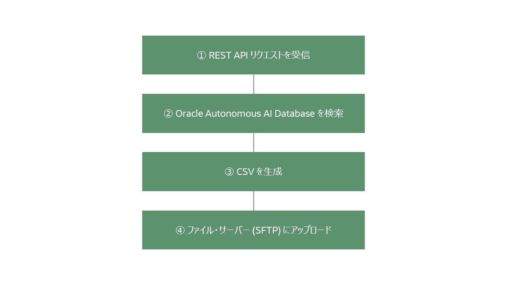

# 1. Oracle Integration 概要

## 1.1 Oracle Integration とは

Oracle Integration は、複数のアプリケーションやサービスを連携し、データ連携や業務処理を自動化するためのサービスです。

REST API、データベース、ファイル、SaaS アプリケーションなど、さまざまなサービスを接続して統合できます。

大量データの分析や蓄積を目的とした ETL/ELT ツールとは異なり、アプリケーション間のリアルタイム連携や業務処理の自動化を得意としています。

また、Oracle SOA Suite のような大規模 SOA 基盤とは設計思想が異なり、クラウドサービスや SaaS を含むシステム間連携を、比較的シンプルかつ迅速に構築できることを重視しています。

## 1.2 このチュートリアルで作成する統合

このチュートリアルでは、REST API で受信した `product_id` をもとに、販売データを CSV ファイルとして出力する統合を作成します。

このチュートリアルで作成する統合の概要は次のとおりです。

## 1.3 このチュートリアルで使用する主な機能

このチュートリアルでは、Oracle Integration の次の機能を使用します。

| 機能 | 用途 |
| --- | --- |
| REST アダプタ | REST API の受信 |
| Oracle ATP アダプタ | Oracle Autonomous AI Database (ADB) の検索 |
| ステージ・ファイル | CSV ファイル生成 |
| FTP アダプタ | ファイル・サーバーへのアップロード |

現時点では、各機能の意味を理解できなくても問題ありません。

このチュートリアルを進めながら、少しずつ理解していきます。

## 1.4 このチュートリアルの進め方

このチュートリアルでは、まず動かすことを重視して、最小限の構成で統合を作成します。

詳細な機能説明よりも、実際に操作しながら Oracle Integration に慣れることを目的としています。

## 1.5 この章のまとめ

この章では、Oracle Integration の概要について簡単に触れました。

次の章では、Oracle Integration で業務の自動化を開発・運用していく際に使用するサービス・コンソールのアクセス方法を確認します。
