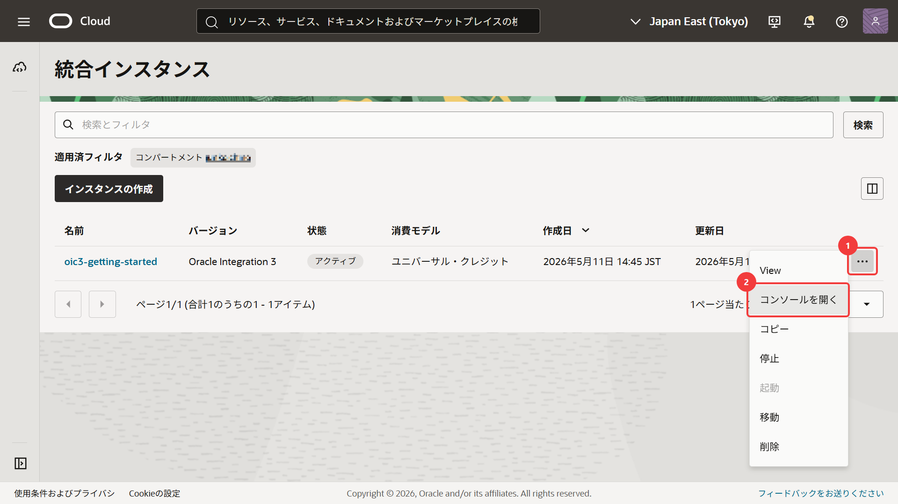
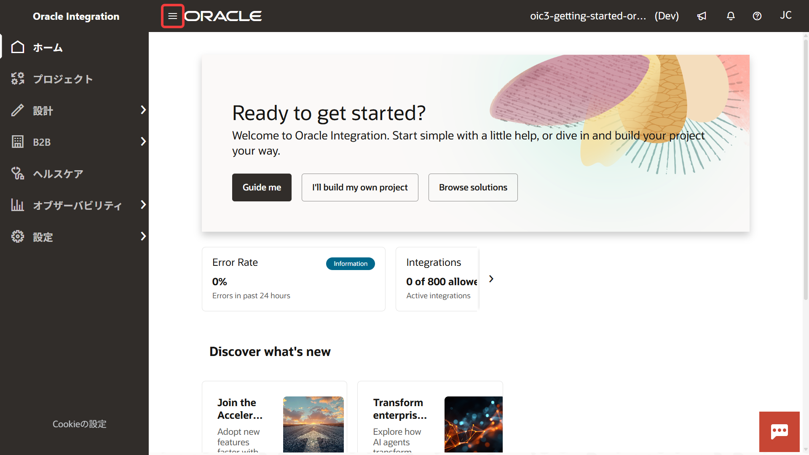

# 2. サービス・コンソールへのアクセス

Oracle Integration の統合や接続は、サービス・コンソールから作成・管理します。

この章では、OCI コンソールから Oracle Integration のサービス・コンソールへアクセスする手順を確認します。

## 2.1 サービス・コンソールとは

Oracle Integration のサービス・コンソールでは、統合の作成・実行・監視などを行えます。

以降の章では、このサービス・コンソールを使用して作業を進めます。

## 2.2 Oracle Integration のサービス・コンソールへアクセス

1.  OCI コンソールにログインします。

2.  OCI コンソールのナビゲーション・メニューで **「開発者サービス」** → **「アプリケーション統合」** → **「統合」** を選択します。

3.  **「統合インスタンス」** ページが表示され、Oracle Integration のサービス・インスタンス一覧が表示されます。

    サービス・インスタンスが表示されない場合は、コンパートメント・フィルタで正しいコンパートメントが選択されていることを確認してください。

4.  このチュートリアルで使用する Oracle Integration のサービス・インスタンスの右側にある **「アクション・メニュー」** をクリックし、**「コンソールを開く」** を選択します。

    

## 2.3 サービス・コンソールの画面構成

サービス・コンソールの左上にある **「ナビゲーション・メニュー」** から、Oracle Integration のさまざまな機能へアクセスできます。

このチュートリアルに関するメニュー項目は次のとおりです。

| メニュー | 用途 |
| --- | --- |
| **「プロジェクト」** | 統合や接続を作成する作業領域 |
| **「可観測性」** | 実行結果やエラーの確認 |
| **「設定」** | ファイル・サーバーや証明書などの設定 |

以降の章では、主に ***プロジェクト*** を使用して作業を進めます。

## 2.4 この章のまとめ

この章では、OCI コンソールから Oracle Integration のサービス・コンソールへアクセスする手順を確認しました。

次の章では、統合や接続をまとめて管理するためのプロジェクトを作成します。
