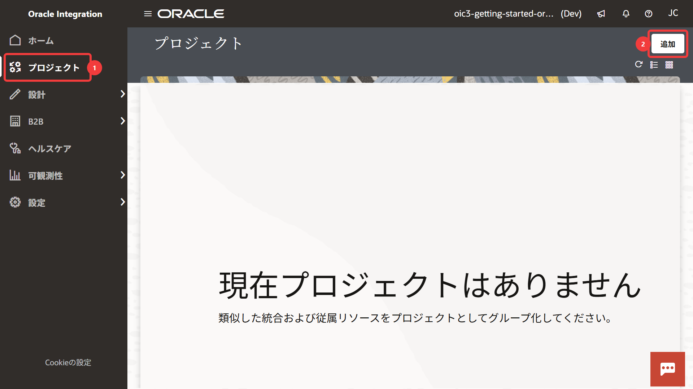
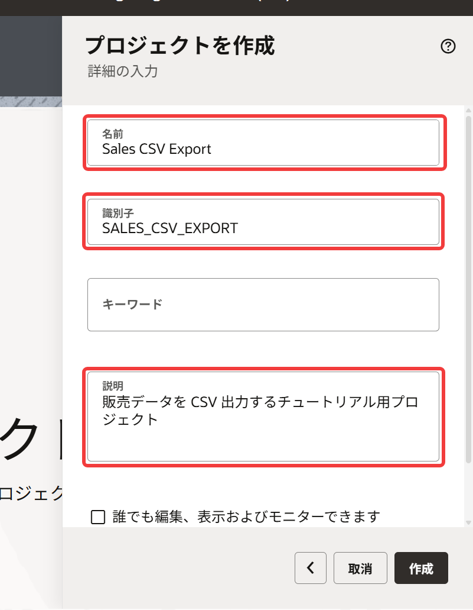
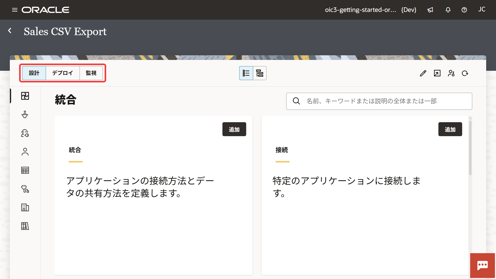

# 3. プロジェクトの作成

このチュートリアルでは、関連するリソースをまとめて管理するため、***プロジェクト (Project)***を使用して作業を進めます。

この章では、プロジェクトの概要と作成手順を説明します。

## 3.1 プロジェクトとは

プロジェクトは、統合・接続・監視などをまとめて管理するための作業領域です。
Oracle Integration では、関連するリソースを 1 つのプロジェクトにまとめて管理できます。

このチュートリアルでも、統合・接続・監視をまとめて扱うために、プロジェクトを作成して作業を進めます。

プロジェクトでは、統合の設計だけでなく、 デプロイや実行結果の監視も行えます。

> **Note:**
>
> Oracle Integration Generation 2 では、統合や接続を個別に管理する構成していました。
>
> Oracle Integration 3 では、統合・接続・監視などをプロジェクト単位でまとめて管理する方法が推奨されています。

## 3.2 プロジェクトの新規作成

1.  Oracle Integration のサービス・コンソールにログインします。

2.  サービス・コンソールの **「ナビゲーション・メニュー」** をクリックし、**「プロジェクト」** をクリックすると **「プロジェクト」** ページが表示されます。
    画面右上の **「追加」** をクリックします。

    

    > **Note:**
    >
    > すでに作成済みのプロジェクトがある場合は、プロジェクトの一覧が表示されます。

3.  画面の右側に **「新規プロジェクトの開始」** パネルが表示されるので、 **「作成」** を選択します。

4.  **「プロジェクトを作成」** パネルが表示されます。
    次の項目を設定します。

    <table>
      <thead>
        <tr>
          <th>設定項目</th>
          <th>設定する値</th>
          <th>備考</th>
        </tr>
      </thead>
      <tbody>
        <tr>
          <td><strong>「名前」</strong></td>
          <td><code>Sales CSV Export</code></td>
          <td></td>
        </tr>
        <tr>
          <td><strong>「識別子」</strong></td>
          <td><code>SALES_CSV_EXPORT</code></td>
          <td>
名前を設定すると自動生成される

サービス・インスタンス内で一意である必要がある
</td>
        </tr>
        <tr>
          <td><strong>「説明」</strong></td>
          <td>任意</td>
          <td>入力例: <code>販売データを CSV 出力するチュートリアル用プロジェクト</code></td>
        </tr>
      </tbody>
    </table>

    

    今回作成したプロジェクトだけでなく、Oracle Integration ではさまざまなコンポーネントの作成時に説明を入力できます。
    説明の入力は省略可能ですが、用途が分かる内容を記載しておくと運用時に識別しやすくなります。

    > **Note:**
    >
    > このチュートリアルを集合形式で実施している場合は、プロジェクト識別子が一意となるように、後ろにイニシャルなどをつけてください（例: `SALES_CSV_EXPORT_AA`）。
    > また、誰のプロジェクトかを識別しやすくするために、ユーザー名など含めることをおすすめします。

5.  **「作成」** をクリックすると、プロジェクトのページが表示されます。

## 3.3 プロジェクトの画面構成

プロジェクトのページは3つのタブ・ページで構成されています。
各タブ・ページの役割は次のとおりです。

| タブ | 主な用途 |
| --- | ------ |
| **「設計」** | 統合や接続などのリソースを作成 |
| **「デプロイ」** | プロジェクトのリソースを別環境へ移行するための管理 |
| **「監視」** | 統合の実行結果やエラーを確認できる |

 

## 3.4 この章のまとめ

この章では、Oracle Integration のプロジェクトの概要と、プロジェクトの作成手順を確認しました。

プロジェクトを使用することで、統合や接続などのリソースをまとめて管理できます。

次の章では、プロジェクト内に統合を作成し、REST API リクエストを受信するための REST Trigger を設定します。
