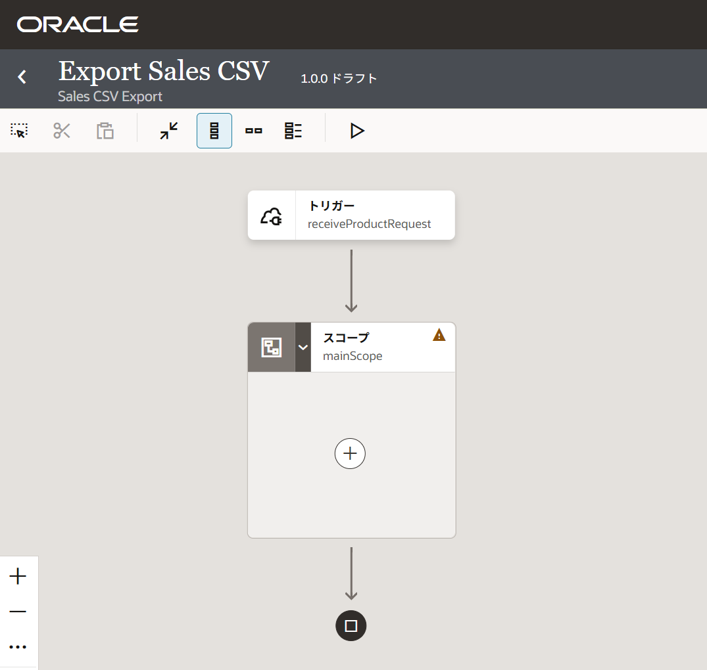
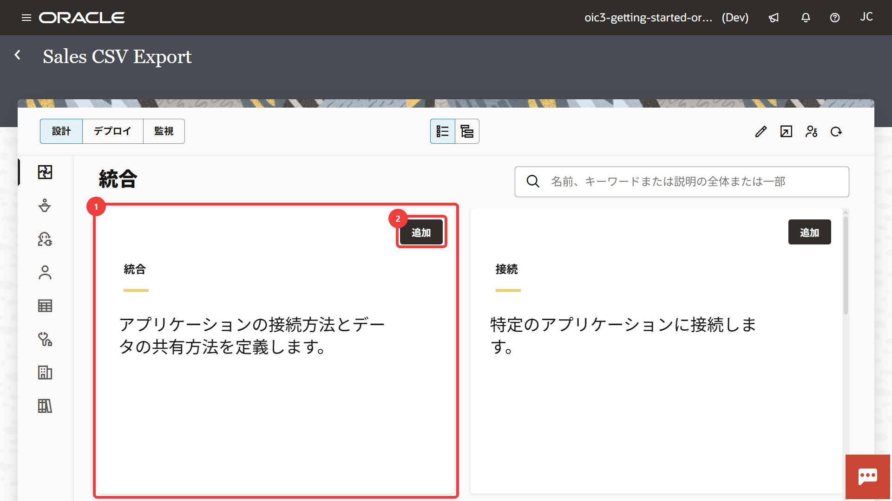
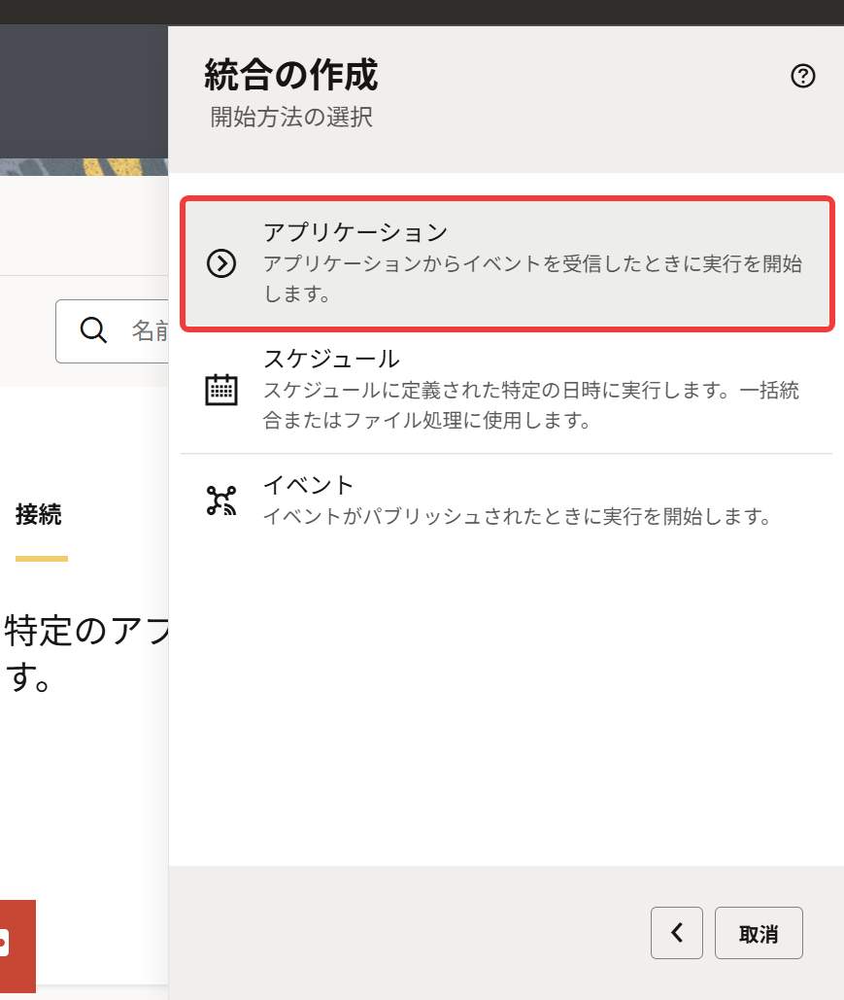
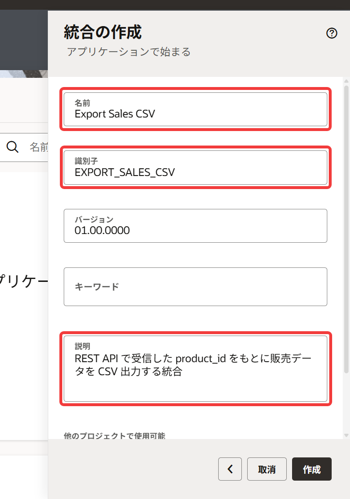
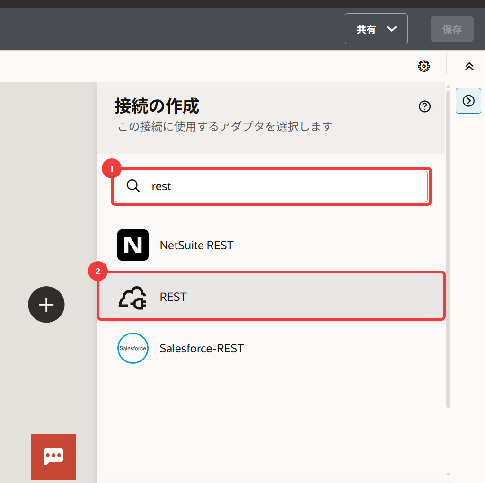
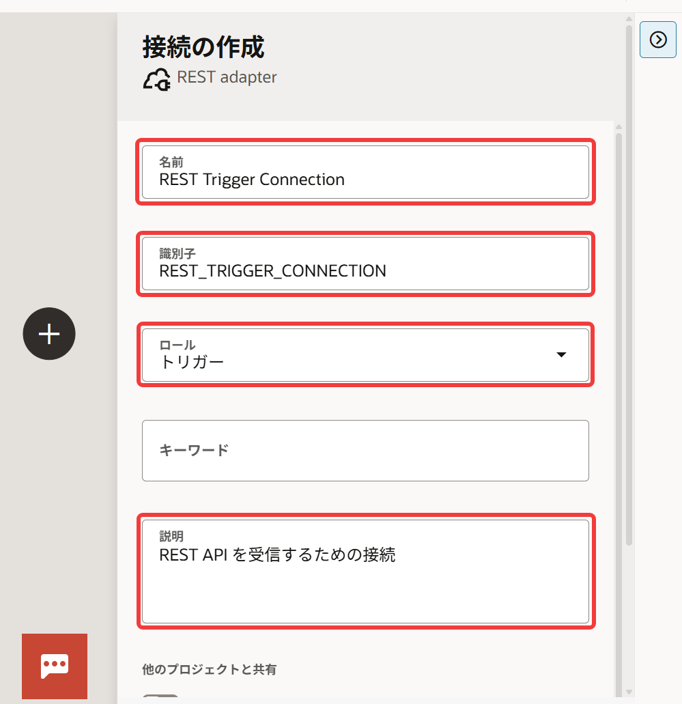
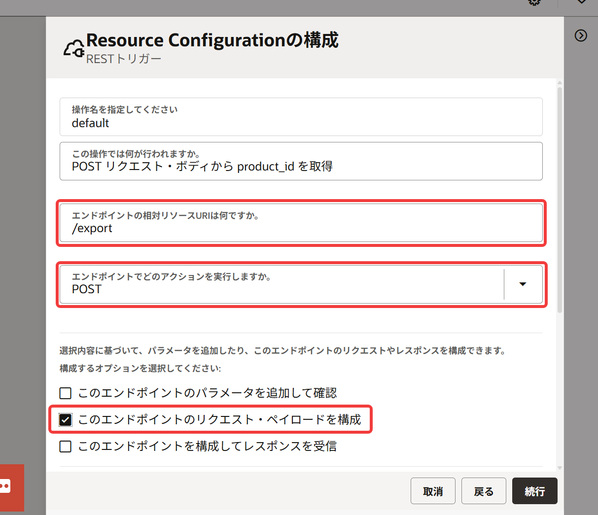
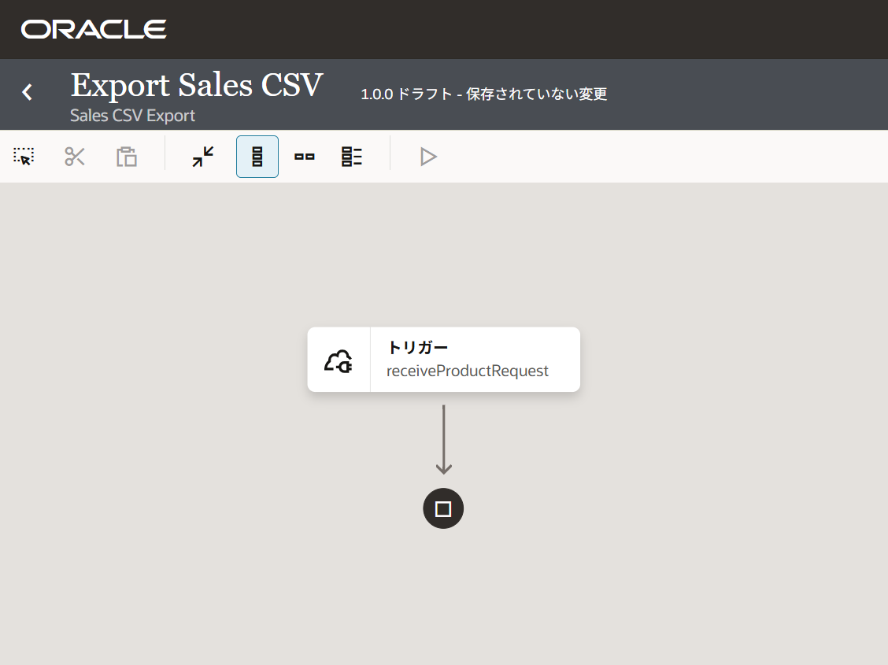

# 4. 統合の作成

Oracle Integration の ***統合（Integration）*** は、複数のシステムを連携し、 処理を自動化する仕組みです。

このチュートリアルでは、REST API リクエストで受信した `product_id` をもとに、データベースから販売データを検索し、結果を CSV ファイルとしてファイル・サーバーへ出力する統合を作成します。

## 4.1 この章で作成する統合

この章では、外部システムから REST API リクエストを受信する統合の土台を作成します。
この章で作成する統合は、次のような流れで動作します。



## 4.2 統合の作成

プロジェクトに統合を作成しましょう。

1.  『[3. プロジェクト](./chapter3.md)』 で作成したプロジェクトを開きます。

2.  プロジェクトの「設計」タブの **「統合」** ページが表示されたら、**「統合」** ボックスの右上にある **「追加」** をクリックします。

    

3.  画面右側に **「統合の追加」** パネルが表示されます。
    **「統合の作成」** をクリックします。

4.  **「統合の作成」** パネルが表示されます。
    **「アプリケーション」** をクリックします。

    

5.  名前など統合の基本情報を次のように設定します。

    <table>
      <thead>
        <tr>
          <th>設定項目</th>
          <th>設定する値</th>
          <th>備考</th>
        </tr>
      </thead>
      <tbody>
        <tr>
          <td><strong>「名前」</strong></td>
          <td><code>Export Sales CSV</code></td>
          <td>&nbsp;</td>
        </tr>
        <tr>
          <td><strong>「識別子」</strong></td>
          <td><code>EXPORT_SALES_CSV</code></td>
          <td>名前を指定すると自動で設定される</td>
        </tr>
        <tr>
          <td><strong>「説明」</strong></td>
          <td>任意</td>
          <td>入力例: <code>REST API で受信した product_id をもとに販売データを CSV 出力する統合</code></td>
        </tr>
      </tbody>
    </table>

    

    他の項目は初期値を受け入れることにして、**「作成」** をクリックします。

6.  統合の設計ツールである ***統合キャンバス*** が表示されます。
    画面の右側には、外部から統合を呼び出すための入口となる ***トリガー*** を作成するための **「接続」** パネルが表示されます。

## 4.3 トリガー接続の作成

Oracle Integration では、外部システムとの接続情報を ***接続(Connection)*** として作成します。
作成した接続は、複数の統合で利用できます。

このセクションでは、外部システムから REST API リクエストを受信するためのトリガー接続を作成します。

1.  **「接続」** パネルが表示されていない場合は、統合キャンバスの右端にある **「トリガー」** をクリックします。

2.  **「トリガーの追加」** をクリックすると、**「接続の作成」** パネルが表示され、トリガーとして利用できるアダプタが表示されます。

3.  検索フィールドに `rest` と入力してアダプタを絞り込み、表示された **「REST」** を選択します。

    

4.  REST アダプタのための **「接続の作成」** パネルが表示されます。
    接続の基本情報を次のように設定します。

    <table>
      <thead>
        <tr>
          <th>設定項目</th>
          <th>設定する値</th>
          <th>備考</th>
        </tr>
      </thead>
      <tbody>
        <tr>
          <td><strong>「名前」</strong></td>
          <td><code>REST Trigger Connection</code></td>
          <td>&nbsp;</td>
        </tr>
        <tr>
          <td><strong>「識別子」</strong></td>
          <td><code>REST_TRIGGER_CONNECTION</code></td>
          <td>名前を指定すると自動に設定される</td>
        </tr>
        <tr>
          <td><strong>「ロール」</strong></td>
          <td><strong>「トリガー」</strong>を選択</td>
          <td>接続のロールは、後から変更できないので要注意</td>
        </tr>
        <tr>
          <td><strong>「説明」</strong></td>
          <td>任意</td>
          <td>入力例: <code>REST API を受信するための接続</code></td>
        </tr>
      </tbody>
    </table>

    

    他の項目は初期値を受け入れることにして、パネルの一番下にある **「作成」** をクリックします。

    > **Note:**
    >
    > 接続の「ロール」は作成後に変更できません。
    >
    > 誤ったロールで作成した場合は、接続を作り直す必要があります。

5.  作成したトリガー接続の詳細を確認、編集するための画面が表示されます。

    > **Note:**
    >
    > 環境やタイミングによっては、接続作成後に接続の詳細画面が自動で表示されない場合があります。
    >
    > その場合は、プロジェクトの「接続」パネルで作成した接続が存在することを確認してください。
    >
    > 接続が正常に作成されていた場合は、接続名をクリックして詳細画面を開きます
    >
    > 接続が正常に作成されていなかった場合は、「接続」パネルの右上にある「＋」をクリックして、再度接続を作成してください。

### 4.3.1 トリガー接続のセキュリティの設定

作成したトリガー接続は、外部からのリクエストを受信する役割を持ちます。

トリガー接続の詳細画面の **「セキュリティ・ポリシー」** では、REST API として統合を呼び出す際の認証方式を設定します。
初期設定では **「OAuth 2.0」** が選択されていますが、**「OAuth 2.0 Or Basic Authentication」** に変更します。
これによって、OAuth 2.0 だけでなく Basic 認証も利用可能になります。

### 4.3.2 トリガー接続のテスト

トリガー接続の詳細画面の右上にある **「テスト」** をクリックして、作成したトリガー接続が利用可能なことを確認します。
接続テスト成功のメッセージが表示されたら、**「保存」** をクリックし、画面左上の **「<」** をクリックして統合キャンバスに戻ります。

画面右側の **「接続」** パネルに、作成したトリガー接続 **「REST Trigger Connection」** が表示されていることを確認してください。

## 4.4 リクエスト受信の設定

このセクションでは、REST API リクエストを受信するための ***エンドポイント (endpoint)***を設定します。

エンドポイントは、外部システムから Oracle Integration を呼び出すための入口です。

このチュートリアルでは、REST API のリクエスト・ボディから `product_id` を受信し、後続の処理で利用します。

1.  統合キャンバス中央にある **「＋」** アイコンをクリックします。
    表示されたパネルには利用できるトリガー接続がリストされているので、**「REST Trigger Connection」** をクリックします。

2.  画面右側に **「Basic Info の構成」** パネルが表示されるので、次のように設定します。

    <table>
      <thead>
        <tr>
          <th>設定項目</th>
          <th>設定する値</th>
          <th>備考</th>
        </tr>
      </thead>
      <tbody>
        <tr>
          <td><strong>「エンドポイントにどのような名前を付けますか。」</strong></td>
          <td><code>receiveProductRequest</code></td>
          <td>&nbsp;</code></td>
        </tr>
        <tr>
          <td><strong>「このエンドポイントでは何が行われますか。」</strong></td>
          <td>任意</td>
          <td>入力例: <code>販売データのエクスポートリクエストを受信</code></td>
        </tr>
        <tr>
          <td><strong>「Select to configure multiple resources or verbs.」</strong></td>
          <td>チェックしない</td>
          <td>&nbsp;</td>
        </tr>
      </tbody>
    </table>

    **「続行」** をクリックします。

3.  **「Resource Configuration の構成」** パネルでは、REST API のリソースの設定をします。

    <table>
      <thead>
        <tr>
          <th>設定項目</th>
          <th>設定する値</th>
          <th>備考</th>
        </tr>
      </thead>
      <tbody>
        <tr>
          <td><strong>「この操作では何が行われますか。」</strong></td>
          <td>任意</td>
          <td>入力例: <code>POST リクエスト・ボディから product_id を取得</code></td>
        </tr>
        <tr>
          <td><strong>「エンドポイントの相対リソース URI は何ですか。」</strong></td>
          <td><code>/export</code></td>
          <td>ここで指定した URI は、REST API の URL の一部として使用される</td>
        </tr>
        <tr>
          <td><strong>「エンドポイントでどのアクションを実行しますか。」</strong></td>
          <td><strong>「POST」</strong>を選択</td>
          <td>リクエスト・ボディで JSON を受信するため HTTP メソッドして POST を使用</td>
        </tr>
        <tr>
          <td><strong>「このエンドポイントのリクエスト・ペイロードを構成」</strong></td>
          <td>チェックする</td>
          <td>REST API のリクエスト・ボディを受信するため</td>
        </tr>
      </tbody>
    </table>

    

    他のチェックボックスはチェックせずに **「続行」** をクリックします。

4.  **リクエストの構成** パネルが表示されます。
    **「リクエスト・ペイロード書式を選択」** で **「JSON サンプル」** が選択されていることを確認します。

5.  REST API リクエストとして受け入れる JSON のサンプルを入力します。
    **「ドラッグ・アンド・ドロップ」** ボックスの下にある **「<<< inline >>>」** をクリックします。

    JSON のサンプルを入力するためのパネルが表示されるので、パネル内のテキスト・エリアに次の JSON を入力します。

    ```json
    {
      "product_id": 30
    }
    ```

    これにより、入力した JSON をもとに Oracle Integration がリクエストのデータ構造を自動生成します。

    テキスト・エリアの下にある **「続行」** をクリックします。

6.  **「リクエストの構成」** パネルに戻ります。
    他の設定項目は初期値を受け入れることにして **「続行」** をクリックします。

7.  **「サマリーの構成」** パネルが表示されたら **「終了」** をクリックします。

## 4.5 統合キャンバスの見方

REST Trigger Connection を統合に追加すると、統合キャンバスに REST トリガーが表示されます。

現在の統合フローは次のようになっています。



統合キャンバスには、コンポーネントが上から下に配置され、矢印の線で接続されています。
現在は、REST API リクエストを受信した後、後続の処理を何も定義していないので、そのまま処理を終了します。

## 4.6 スコープの追加

このセクションでは、メインの処理を追加していく ***スコープ (Scope)*** を統統に追加します。
スコープは、複数の処理をまとめるためのコンポーネントです。

1.  トリガーと停止アイコンを接続している矢印の線にマウス・ポインタを合わせます。
    線の中央に表示された **「＋」** アイコンをクリックします。

2.  表示されたパネルの **「提案」** セクションにある **「スコープ」** をクリックします。

3.  画面の右側に **「編集 スコープ」** パネルが表示されます。
    ここでは初期設定された名前 **「Scope1」** をわかりやすい名前に変更します。
    画面右側の **「編集」** をクリックします。

4.  **「Name」** と **「Description」** フィールドが表示されるので、次のように設定します。

    <table>
      <thead>
        <tr>
          <th>設定項目</th>
          <th>設定する値</th>
          <th>備考</th>
        </tr>
      </thead>
      <tbody>
        <tr>
          <td><strong>「Name」</strong></td>
          <td><code>mainScope</code></td>
          <td></td>
        </tr>
        <tr>
          <td><strong>「Description」</strong></td>
          <td>任意</td>
          <td>入力例: <code>この統合のメインの処理</code></td>
        </tr>
      </tbody>
    </table>

    **「適用」** をクリックします。

> **Note:**
>
> 統合キャンバスの右端に、統合にエラーがあることを表すエラー・アイコンが表示されますが、後続の処理を追加していくことで解消されるので、現時点では気にする必要はありません。

## 4.7 統合の保存

ここまで作成した統合を保存します。
統合は、統合キャンバスの右上にある **「保存」** をクリックすることで保存されます。

この後は、変更を行ったら適宜、変更を保存するようにしましょう。

## 4.8 この章のまとめ

この章では、REST API リクエストを受信するための統合を作成しました。


作成した統合では、REST Trigger を使用して `/export` エンドポイントで POST リクエストを受信できるように設定しました。

また、後続の処理を追加するための `mainScope` を作成し、統合キャンバス上で処理フローを構成する基本的な方法を確認しました。

次の章では、Oracle Autonomous AI Database に接続し、受信した `product_id` を使って販売データを取得する処理を作成します。
