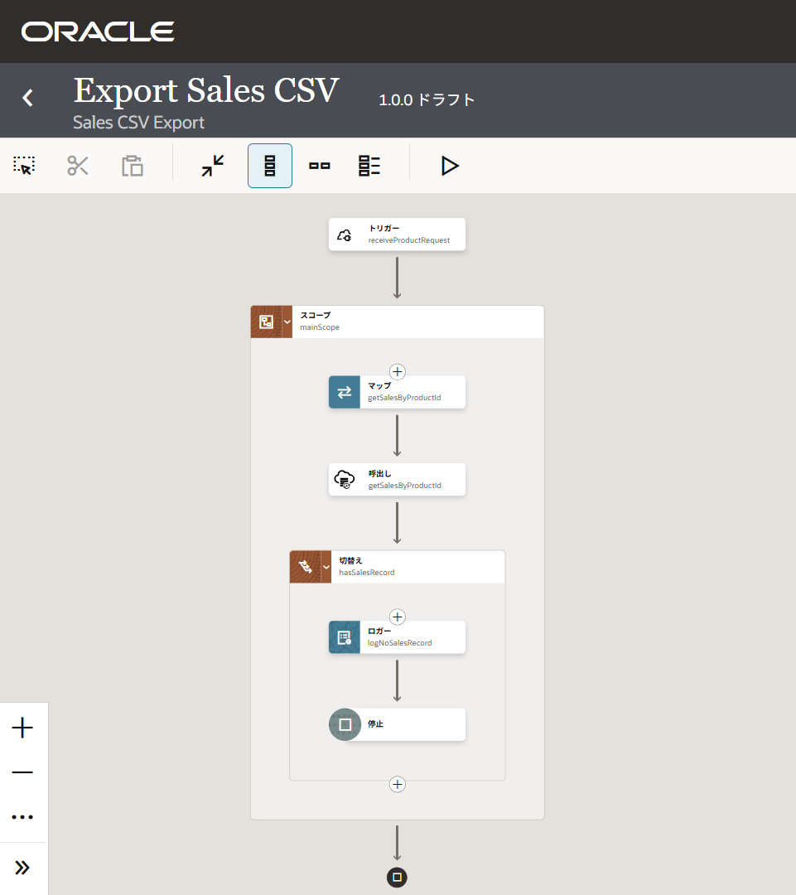

# 5. データの取得

この章では、ATP アダプタを使用してデータベース表から指定した商品の販売履歴を取得します。

REST Trigger Connection で受信した `product_id` を SQL のバインド変数にマッピングし、サンプル・スキーマ 'SH' の 'SALES' 表を検索します。
また、検索結果が存在しない場合は、後続の CSV 出力処理を実行しないように判定ロジックを追加します。

## 5.1 データ取得処理の概要

この章では、以下の流れで処理を作成します。

1.  ATP アダプタ接続の作成
2.  検索処理の実装
    + 統合への ATP アダプタ検索処理の設定
    + バインド変数の値の設定
3.  検索結果のレコード数のチェック
    + 切替えアクションによる条件判定
    + ロガー・アクションによるメッセージの出力
    + 停止アクションによる処理の終了

完成後のフローは、次のようになります。



## 5.2 事前準備

Oracle ATP アダプタを使用して Oracle ADB に接続するには、事前にデータベース接続情報を準備する必要があります。

このチュートリアルでは、事前に次の設定が行われていることを前提としています。

- Oracle ADB インスタンスの作成
- データベース・ユーザーの作成
- ウォレットのダウンロード
- データベースへの接続情報の取得

### 5.2.1 Oracle ADB インスタンスの作成

ADB のインスタンスは OCI コンソールから作成することができます。

このチュートリアルでは、Oracle ADB に対してすべての場所からのセキュアアクセスを許可されていることを前提としています。
詳細は、OCI チュートリアルの『[101: ADBインスタンスを作成してみよう](https://oracle-japan.github.io/ocitutorials/adb/adb101-provisioning/)』を参照してください。

### 5.2.2 データベース・ユーザーの作成

このチュートリアルでは、 `OIC_USER` というユーザーを作成し、事前定義されたロール `DWROLE` が付与されていることを前提としています。

詳細は、OCI チュートリアルの『[101: ADBインスタンスを作成してみよう](https://oracle-japan.github.io/ocitutorials/adb/adb101-provisioning/)』を参照してください。

### 5.2.3 ウォレットのダウンロード

Oracle Integration から ADB に接続するには、クライアント資格証明（ウォレット）が必要です。
ウォレットには、Autonomous Database へ安全に接続するための証明書や接続情報が含まれています。

ウォレットは、ATP の詳細画面からダウンロードできます。

1.  OCI コンソールにログインし、アクセスする ADB の詳細ページを開きます。

2.  **「データベース接続」** をクリックします。

3.  画面右側に **「データベース接続」** パネルが表示されます。
    **「ウォレット・タイプ」** で **「インスタンス・ウォレット」** を選択し、**「ウォレットのダウンロード」** をクリックします。

    

4.  **「ウォレットのダウンロード」** パネルが表示され、ウォレットのパスワードの作成を入力を求められます。
    **「パスワード」** と **「パスワードの確認」** に同じパスワード（英数字を含む8文字以上）を入力し、画面左下の **「ダウンロード」** をクリックします。

    

    > **Note:**
    >
    > ここで設定したパスワードは、ATP アダプタ接続を作成する際に必要になるので忘れないようにしてください。

5.  Zip ファイルがダウンロードされます。

### 5.2.4 データベースへの接続情報の取得

ATP アダプタ接続を作成するためには、次の情報が必要です。

- ホスト名
- ポート番号
- TNS 名

これらの情報は、ウォレットのダウンロードと同様に **「データベース接続」** パネルの **「接続文字列」** セクションで確認が可能です。

**「接続文字列」** セクションには複数のTNS名が表示されていますが、本チュートリアルでは末尾が `_low` の TNS 名を使用します。

TNS名と、その接続文字列はテキスト・エディタなどに保存しておいてください。
接続文字列は、 **「アクション」** → **「コピー」** を選択することで、クリップボードにコピーすることが可能です。


接続情報が取得出来たら **「取消」** をクリックしてパネル閉じます。

## 5.3 ATP アダプタ接続の作成

ウォレットのダウンロードとデータベース接続情報の取得が終わったら、Oracle Integration のサービス・コンソールで ATP アダプタ接続を作成します。

1.  Oracle Integration のサービス・コンソールで、このチュートリアルで作成した統合を開きます。

2.  統合キャンバスの右端にある **「呼び出し」** をクリックします。

3.  画面の右側に **「接続」** パネルが表示されるので、**「接続の作成」** をクリックします。

4.  **「接続の作成」** パネルが表示されたら、検索フィールドに `atp` と入力して、アダプタを絞り込みます。

5.  表示された **「Oracle ATP」** をクリックすると、Oracle ATP アアダプ接続の基本情報の入力を求められるので、次のように入力します。

    + **「名前」**: `ATP Connection`
    + **「識別子」**: `ATP_CONNECTION` (名前を入力すると自動的に設定される)
    + **「ロール」**: **「呼出し」** を選択

    他の項目は、デフォルトの値を受け入れることにして、パネルの一番下にある **「作成」** をクリックします。

### 5.3.1 ATP アダプタ接続のプロパティの設定

Oracle ATP アダプタ接続が作成されると、データベースにアクセスするための詳細情報を入力するための画面が表示されます。

1.  **「プロパティ」** セクションで、**「オプションのプロパティ」** をクリックします。

2.  次の値を入力します。

    + **「Host」**: 本チュートリアルの『5.2.4 データベースへの接続情報の取得』で保存しておいた接続文字列に記述されている `host` の値
    + **「Port」**: Host と同様に `port` の値
    + **「SID」**: *本チュートリアルでは値を指定しない*
    + **「Service Name」**: 本チュートリアルの『5.2.4 データベースへの接続情報の取得』で保存しておいたTNS名

### 5.3.2 ATP アダプタ接続のセキュリティの設定

次に、データベース・アクセスに必要なセキュリティに関する情報を入力します。

1.  **「セキュリティ」** セクションの **「セキュリティ・ポリシー」** で、**「JDBC Over SSL」** を選択します。

2.  **「Wallet」** フィールドの **「アップロード」** をクリックし、本チュートリアルの『5.2.3 ウォレットのダウンロード』でダウンロードしておいた Zip ファイルをアップロードします。

3.  **「Wallet Password」** には、ウォレットをダウンロードする時に指定したパスワードを入力します。

4.  **「Database Service Username」** と **「Database Service Password」** には、このチュートリアル用のデータベース・ユーザーとそのパスワードを入力します。

### 5.3.3 ATP アダプタ接続のアクセス・タイプの選択

Oracle Integration のアダプタ接続は、ターゲットとなるサービスへのアクセス・タイプを選択する必要があります。
このチュートリアルでは、Oracle ADB はすべての場所からのセキュアアクセスが許可されていることを前提としているので、 **「パブリック・ゲートウェイ」** を選択します。

> **Note:**
>
> Public Gateway は、Oracle Integration から対象のシステムにインターネット経由で接続する最も基本的な接続方式です。

### 5.3.4 ATP アダプタ接続のテストと保存

Oracle Integration で作成したアダプタ接続は、保存する前に接続のテストが必要です。

画面右上にある **「テスト」** をクリックし、Oracle Integration から ADB にアクセスできることを確認します。

> **Note:**
>
> 接続テストには数秒かかる場合があります。

**「接続 <アダプタ接続名> が正常にテストされました」** というメッセージが表示されたら、接続のテストは成功です。

テストに成功したら、画面右上の **「保存」** をクリックしてから、画面の左上の **「＜」** をクリックします。

## 5.4 検索処理の実装

### 5.4.1 統合への ATP アダプタの追加

1.  スコープ mainScope 内の **「＋」** アイコンをクリックします。
    **「呼出し」** タブを選択し、**「使用可能な接続」** にリストされている **「ATP Connection」** をクリックします。

2.  画面の右側に **「基本情報の構成」** パネルが表示されるので、次のように入力します。

    + **「エンドポイントにどのような名前を付けますか。」**: `getSalesByProductId` と入力
    + **「このエンドポイントでは何が行われますか」**: 任意（入力例: `SH.SALES 表を PROD_ID で検索`）
    + **「どの操作を実行しますか。」**: **「Run a SQL Statement」** を選択

    **「続行」** をクリックします。

3.  **「SQL文の実行の構成」** パネルが表示されるので、**「SQL問合せ」** に次の SQL 文を入力します。

    ```sql
    SELECT PROD_ID, TIME_ID, QUANTITY_SOLD, AMOUNT_SOLD
      FROM SH.SALES
      WHERE PROD_ID = #VAR_PRODUCT_ID
    ```

    `#VAR_PRODUCT_ID` はバインド変数で、実行時に値を指定します。
    このチュートリアルではこの後マッパーを使用して、リクエスト・ボディの `product_id` をこのバインド変数に渡します。

4.  SQL 文を入力したら **「SQL問合せの検証」** をクリックします。
    **「成功しました。」** と表示されたら **「続行」** をクリックします。

5.  **「サマリーの構成」** パネルが表示されたら、**「終了」** をクリックします。

    スコープ mainScope 内に **「マップ」** と **「呼出し」** の2つのボックスが追加されます。

## 5.4.2 バインド変数の値の設定

1.  5.4 で mainScope 内に追加された **「マップ」** をダブルクリックします。

2.  マッパーの画面が表示されます。

3.  **「Sources」** ツリーの要素を **「Target」** ツリーの要素にドラッグ & ドロップします。

    + ドラッグする要素: **「receiveProductRequest Request (REST)」** → **「RequestWrapper」** → **「Product Id」**
    + ドロップする要素: **「getSalesByProductId Request (Oracle ATP)」** → **「VAR_PRODUCT_ID」**

4.  ドラッグ & ドロップしたら、画面右上の **「検証」** をクリックします。

    **「マップ先 getSalesByProductId は正常に検証されました。」** というメッセージが表示されたら、画面左上の **「＜」** をクリックして、統合キャンバスに戻ります。

## 5.6 検索結果のレコード数のチェック

### 5.6.1 Switch アクションによる条件判定

1.  **「呼出し getSalesByProductId」** の下の **「＋」** アイコンをクリックします。

2.  表示されたパネルの **「提案」** セクションにある **「切替え」** をクリックします。

3.  画面の右側に **「ルートの構成」** パネルが表示されます。
    名前を `hasSalesRecord` に変更します。

4.  上にある **「Value」** フィールドの右側にある **「開発者ビューに切替え」** をクリックします。

5.  パネルの左側にある **「関数」** タブをクリックし、 **「Node-set」** の下の **「count」** を上にある **「Value」** フィールドにドラッグ & ドロップします。

    **「Value」** フィールドに `fn:count(nodeSet)` が追加されます。
    `nodeSet` は関数の引数のプレースホルダで、実際の値と置き換える必要があります。

6.  パネルの左側にある **「入力ソース」** タブをクリックし、**「Sources」** ツリーの要素をドラッグ & ドロップしてプレースホルダと置き換えます。

    + ドラッグする要素: **「$getSalesByProductId」** → **「getSalesByProductIdOutputCollection」** → **「getSalesByProductIdOutput」**
    + ドロップするターゲット: 上の **「Value」** フィールドに表示されているプレースホルダ `nodeSet`

      > **Note:**
      > ドロップする前にテキスト `nodeSet` の部分を選択しておくとドロップしやすくなります。

    上にある **「Value」** フィールドには次のように設定されます（この値をフィールドにコピー & ペーストしても問題ありません）。

    ```xpath
    fn:count($getSalesByProductId/db:getSalesByProductIdOutputCollection/db:getSalesByProductIdOutput)
    ```

7.  **「Operator」** で **「=」** を選択し、下にある **「Value」** フィールドに `0` と入力します。

### 5.6.2 ロガー・アクションによるメッセージ出力

1.  **「切替え hasSalesRecord」** の中の **「＋」** アイコンをクリックします。

2.  表示されたパネルの **「アクション」** タブをクリックし、リストから **「ロガー」** を選択します。

3.  画面の右側に **「ロガーを構成」** パネルが表示されます。
    `Logger1` から `logNoSalesRecord` に名前を変更します。

4.  **「ロガー・メッセージ」** フィールドに次のように入力します。

    ```txt
    '該当するレコードがありませんでした'
    ```

    > **Note:**
    >
    > シングル・クォーテーション `'` で囲う必要があります

### 5.6.3 停止アクションによる統統の終了

1.  5.6.2 で追加した **「ロガー」** の下にある **「＋」** アイコンをクリックします。

2.  表示されたパネルの **「アクション」** タブをクリックし、一番下にある **「停止」** を選択します。

## 5.7 この章のまとめ

この章では、ATP アダプタを使用したデータベース表の問合せを実装しました。


- ATP アダプタ接続の作成
- ATP アダプタ接続の統合への追加
- SQL バインド変数のマッピング
- Switch アクションによるレコード存在確認の実装

次の章では、取得したデータを CSV ファイルとして生成し、SFTP サーバーへアップロードします。
