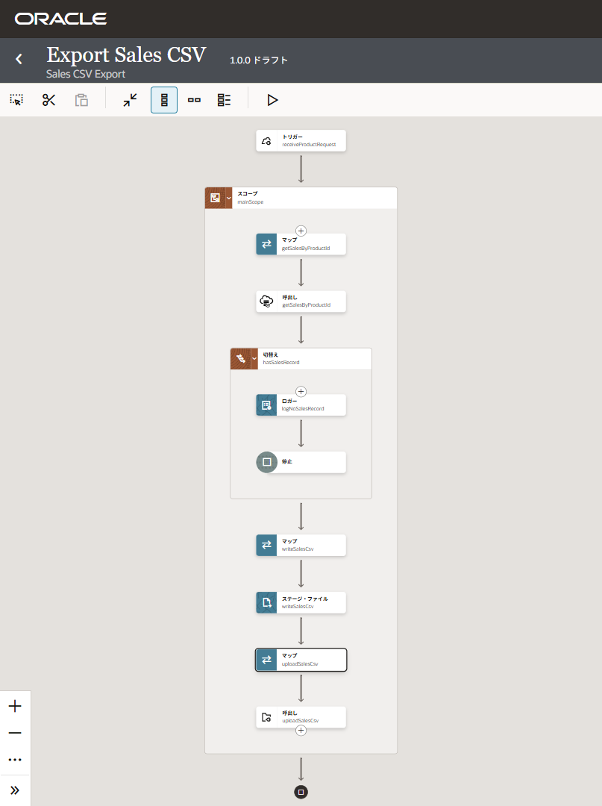
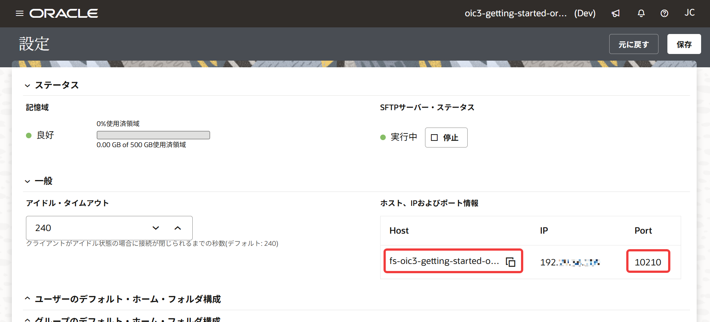
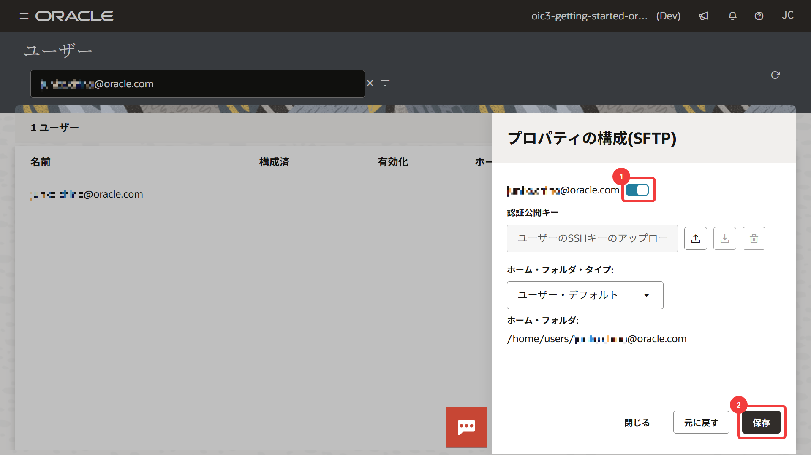
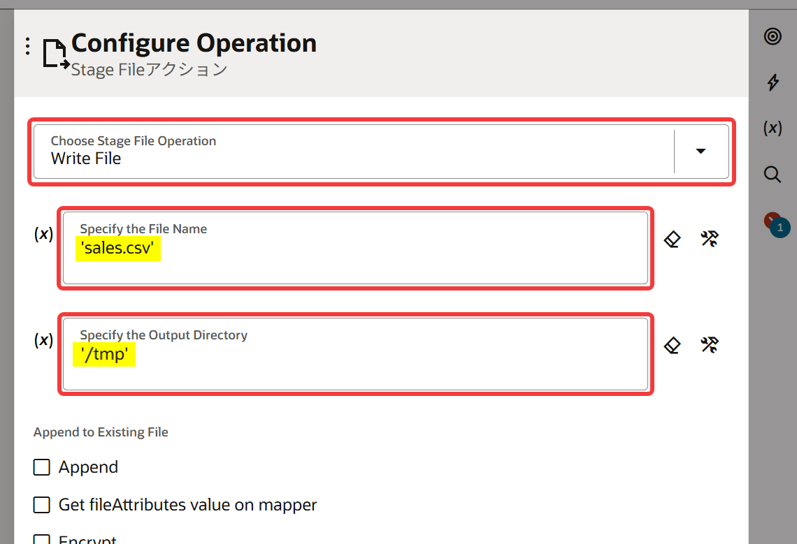
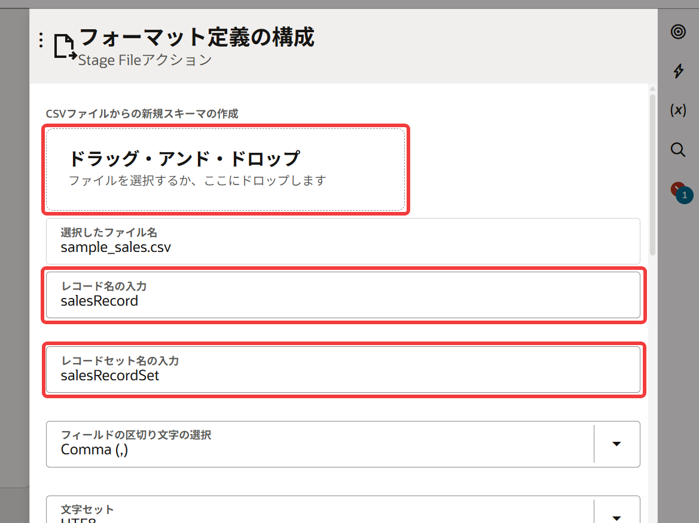
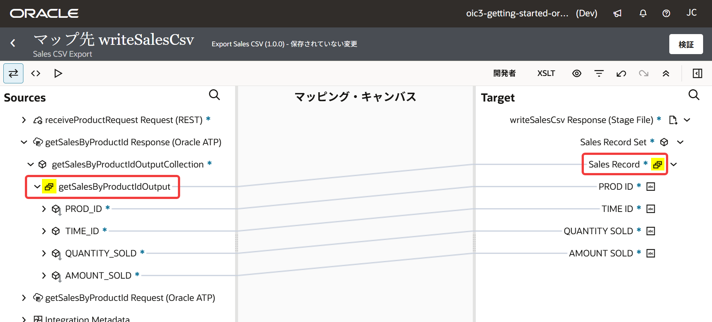
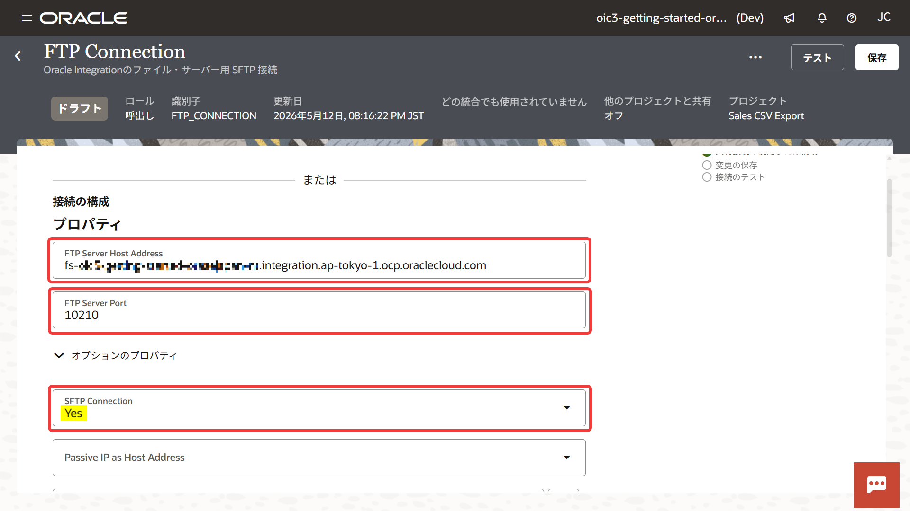
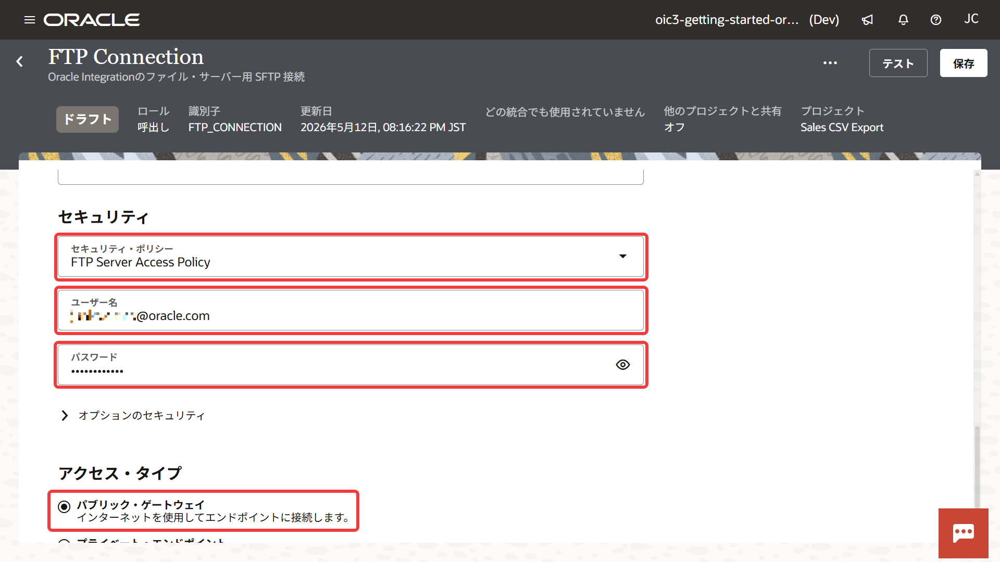
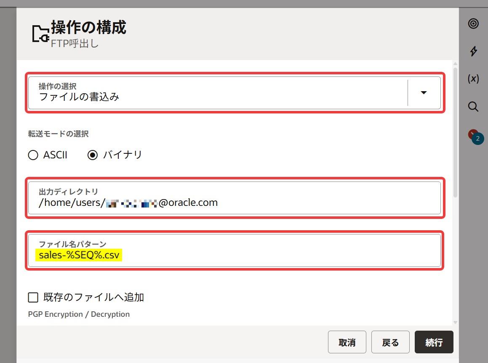
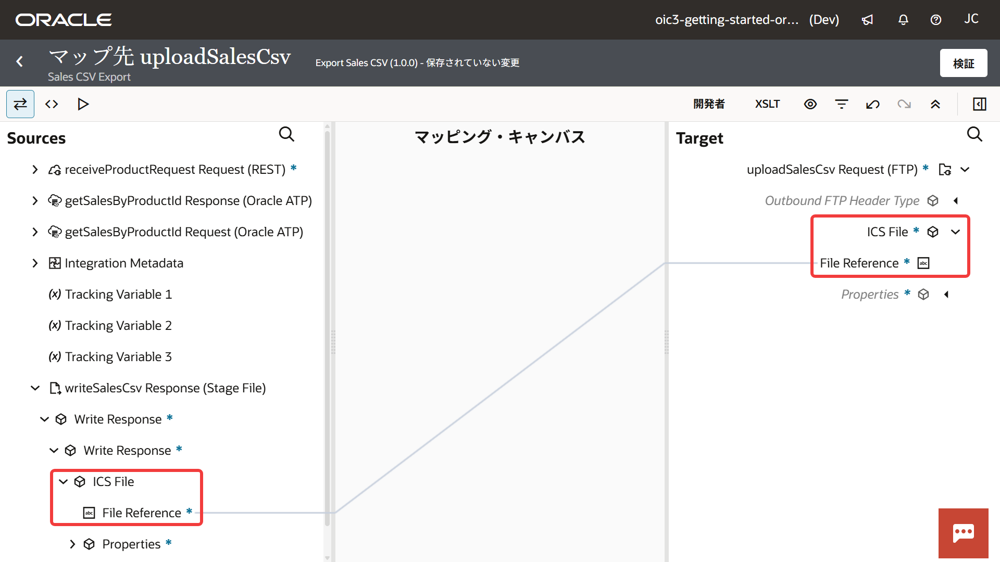

# 6. ファイル連携

この章では、取得したデータを CSV ファイルとして生成し、FTP アダプタを使用して Oracle Integration のファイル・サーバーへアップロードします。

## 6.1 ファイル連携処理の概要

この章では、データベースから取得した販売データを一時ファイルとして CSV 形式で出力し、Oracle Integration のファイル・サーバーへアップロードします。

Oracle Integration では、一時ファイルの生成に Stage File アクションを使用し、外部ファイル・サーバーとの連携に FTP Adapter を使用します。

## 6.2 事前準備

Oracle Integration のファイル・サーバーは、SFTP に準拠したサーバーとして提供されており、外部の SFTP クライアントからアクセスできます。

この章では、FTP アダプタ接続を使用してデータベース表の検索結果を CSV に書き出して Oracle Integration のファイル・サーバーにアップロードするので、次の設定が事前に行われている必要があります。

- ファイル・サーバーの有効化
- ファイル・サーバーへの接続情報の取得
- ファイル・サーバーへのユーザー・アクセスの有効化

### 6.2.1 ファイル・サーバーの有効化

Oracle Integration のファイル・サーバーは、サービス・インスタンスが作成された直後は無効化されています。
Oracle Integration のファイル・サーバーを利用するには、事前にファイル・サーバーを有効化する必要があります。

Oracle Cloud コンソールの Oracle Integration のサービス・インスタンスの詳細画面で、 **「設定」** セクションの **「ファイル・サーバー」** が **「有効」** と表示されていれば、ファイル・サーバーはすでに有効化されています。

ファイル・サーバーを有効化する手順の詳細は次のドキュメントを参照してください:

- [追加機能の有効化](https://docs.oracle.com/ja-jp/iaas/application-integration/doc/enable-additional-features.html) (日本語機械翻訳版)
- [Enable Additional Features](https://docs.oracle.com/en-us/iaas/application-integration/doc/enable-additional-features.html) (英語オリジナル版)

### 6.2.2 ファイル・サーバーへの接続情報の取得

Oracle Integration のファイル・サーバーを有効化すると、その接続情報は Oracle Integration のサービス・コンソールから確認できます。

ファイル・サーバーの設定は、サービス・コンソールのナビゲーション・メニューで **「設定」** → **「ファイル・サーバー」** → **「設定」** を選択します。

FTP アダプタ接続を作成するために、この画面で次の接続情報を確認してメモ帳などに保存しておいてください。

- ホスト名
- ポート番号

### 6.2.3 ファイル・サーバーへのユーザーのアクセスの有効化

ファイル・サーバーに SFTP クライアントからアクセスするためには、ユーザーのアクセスを有効化する必要があります。

現在 Oracle Integration にログインしているユーザーでファイル・サーバーにアクセスできるようにするには、次の手順が必要です。

> **Warning:**
>
> この操作を実行するには Oracle Integration のアプリケーション・ロール ServiceAdministrator が付与されている必要があります。

1.  サービス・コンソールのナビゲーション・メニューで **「設定」** → **「ファイル・サーバー」** → **「ユーザー」** を選択します。

2.  **「入力検索を開く」** をクリックし、検索フィールドに Oracle Integration にログインしたユーザー名を入力して [Enter] を押します。

3.  表示されたユーザーの行の右側にある 「編集」 をクリックします。
    画面の右側に 「プロパティの構成 (SFTP)」 パネルが表示されます。

4.  ユーザー名の右横に表示されるスイッチをオンにし、他の項目は初期設定を受け入れることにして **「保存」** をクリックします。

    

    これにより、ファイル・サーバーにユーザー名/パスワードでアクセスが可能になりました。

> **Note:**
>
> Oracle Integration のファイル・サーバーは公開鍵/非公開鍵を用いた認証にも対応しています。
> 詳細は次のドキュメントを参照してください:
>
> - [ファイル・サーバーの有効化](https://docs.oracle.com/cd/G41715_01/paas/application-integration/file-server/enable-file-server.html) (日本語機械翻訳版)
> - [Enable File Server](https://docs.oracle.com/en/cloud/paas/application-integration/file-server/enable-file-server.html) (英語オリジナル版)

## 6.3 CSV ファイルの生成

ステージ・ファイル・アクションは、統合の実行中に一時的なファイルを作成したり、読み込んだりするためのアクションです。

Oracle Integration では、CSV や XML などのファイルを生成する際にステージ・ファイル・アクションを使用します。
生成されたファイルは、後続の FTP アダプタなどへ受け渡すことができます。

スキーマは、CSV や XML などのデータ構造を定義する情報です。
Oracle Integration は、このスキーマをもとに Oracle Mapper でデータ項目を処理します。

ここでは、データベースの検索結果を CSV ファイルとして書き出します。

### 6.3.1 ステージ・ファイル・アクションによる CSV ファイル生成の設定

1.  Oracle Integration の統合キャンバスで、このチュートリアルで作成した統合 Export Sales CSV を開きます。

2.  [5. データの取得](chapter5.md) で追加した **「切替え hasSalesRecord」** の下にある **「＋」** アイコンをクリックします。
    表示されたパネルで **「アクション」** タブをクリックし、 **「ステージ・アクション」** を選択します。

3.  Stage File アクションの **「基本情報の構成」** パネルが表示されます。
    次の項目を入力します。

    <table>
      <thead>
        <tr>
          <th>設定項目</th>
          <th>設定する値</th>
          <th>備考</th>
        </tr>
      </thead>
      <tbody>
        <tr>
          <td><strong>「What do you want to call your action?」</strong></td>
          <td><code>writeSalesCsv</code></td>
          <td></td>
        </tr>
        <tr>
          <td><strong>「What does this action do?」</strong></td>
          <td>任意</td>
          <td>入力例: <code>SALES 表の検索結果を CSV に書き出す</code></td>
        </tr>
      </tbody>
    </table>

    **「続行」** をクリックします。

4.  **「Configure Operation」** パネルが表示されます。
    次の項目を入力します。

    <table>
      <thead>
        <tr>
          <th>設定項目</th>
          <th>設定する値</th>
          <th>備考</th>
        </tr>
      </thead>
      <tbody>
        <tr>
          <td><strong>「Choose Stage File Operation」</strong></td>
          <td><strong>「Write File」</strong> を選択</td>
          <td></td>
        </tr>
        <tr>
          <td><strong>「Specify the File Name」</strong></td>
          <td><code>'sales.csv'</code> と入力</td>
          <td>シングル・クォーテーションが必要</td>
        </tr>
        <tr>
          <td><strong>「Specify the Output Directory」</strong></td>
          <td><code>'/tmp'</code> と入力</td>
          <td>同上</td>
        </tr>
      </tbody>
    </table>

    

    他の項目は初期値を受け入れることにして **「続行」** をクリックします。

5.  **「Schema Options の構成」** パネルが表示されます。
    **「次の選択肢の中のどれをファイル・コンテンツの構造の説明に使用しますか。」** で、**「サンプル区切りドキュメント (例: CSV)」** が選択されていることを確認して **「続行」** をクリックします。

6.  **「フォーマット定義の構成」** パネルが表示されます。
    [サンプル CSV ファイル](./resources/sample_sales.csv) をダウンロードして、 **「ドラッグ・アンド・ドロップ」** と書かれたボックスにドラッグ & ドロップします。

7.  *レコード*（CSV の 1 行分のデータ）と *レコードセット*（CSV 全体） に名前を付けます。

    <table>
      <thead>
        <tr>
          <th>設定項目</th>
          <th>設定する値</th>
        </tr>
      </thead>
      <tbody>
        <tr>
          <td><strong>「レコード名の入力」</strong></td>
          <td><code>salesRecord</code> と入力</td>
        </tr>
        <tr>
          <td><strong>「レコードセット名の入力」</strong></td>
          <td><code>salesRecordSet</code> と入力</td>
        </tr>
      </tbody>
    </table>

    

    他の項目は初期値を受け入れることにして **「続行」** をクリックします。

8.  **「サマリーの構成」** パネルが表示されたら **「終了」** をクリックします。

    **「切替え hasSalesRecord」** の下に **「マップ writeSalesCsv」** と **「ステージ・ファイル writeSalesCsv」** が追加されます。

    > **Note:**
    >
    > Stage File アクション `writeSalesCsv` は、スコープ `mainScope` の中にある必要があります。
    > `mainScope` の外に作成すると、Stage File アクション自体は追加できますが、Oracle Mapper でデータベースの検索を参照できません。

### 6.3.2 SQL の問合せ結果と CSV のマッピング

1.  6.3.1 で追加された **「マップ writeSalesCsv」** をダブルクリックします。
    Oracle Mapper の画面が表示されます。

2.  画面左の **「Sources」** ツリーで **「getSalesByProductId Response (Oracle ATP)」** → **「getSalesByProductIdOutputCollection」** ノードを開きます。

3.  画面右の **「Target」** ツリーで **「writeSalesCsv Response (Stage File)」** → **「Sales Record Set」** ノードを開きます。

4.  **「Sources」** ツリーの **「getSalesByProductIdOutput」** をドラッグし、 **「Target」** ツリー の **「Sales Record」** の上にドロップします。

    > **Note:**
    >
    > **「getSalesByProductIdOutput」** と **「Sales Record」** にはカードが重なったアイコンがついています。
    > このアイコンは複数のデータを扱う繰り返し要素であることを表しています。
    > **「getSalesByProductIdOutput」** と **「Sales Record」** をマッピングすることで、SQL の検索結果に含まれる複数レコードを CSV の複数行として処理できます。

5.  **「getSalesByProductIdOutput」** の下の各要素を **「Sales Record」** の下の各要素上にドラッグ & ドロップします。

    <table>
      <thead>
        <tr>
          <th>ドラッグする要素</th>
          <th>ドロップ先の要素</th>
        </tr>
      </thead>
      <tbody>
        <tr>
          <td>PROD_ID</td>
          <td>PROD ID</td>
        </tr>
        <tr>
          <td>TIME_ID</td>
          <td>TIME ID</td>
        </tr>
        <tr>
          <td>QUANTITY_SOLD</td>
          <td>QUANTITY SOLD</td>
        </tr>
        <tr>
          <td>AMOUNT_SOLD</td>
          <td>AMOUNT SOLD</td>
        </tr>
      </tbody>
    </table>

    

6.  **「検証」** をクリックして正常に検証されたら、画面左上の **「<」** をクリックして統合キャンバスに戻ります。

## 6.4 FTP アダプタ接続の作成

生成した CSV ファイルを Oracle Integration のファイル・サーバーへアップロードするため、FTP アダプタを使用した接続を作成します。

Oracle Integration のファイル・サーバーは SFTP に対応しているため、FTP アダプタから SFTP 接続として利用できます。

1.  統合キャンバスの右端にある **「呼出し」** をクリックします。

2.  画面の右側に **「接続」** パネルが表示されるので、「接続の作成」 をクリックします。

3.  「接続の作成」 パネルが表示されたら、検索フィールドに `ftp` と入力して、アダプタを絞り込みます。

4.  表示された 「FTP」 をクリックすると、FTP アダプタ接続の基本情報の入力を求められるので、次のように入力します。

    <table>
      <thead>
        <tr>
          <th>設定項目</th>
          <th>設定する値</th>
          <th>備考</th>
        </tr>
      </thead>
      <tbody>
        <tr>
          <td><strong>「名前」</strong></td>
          <td><code>FTP Connection</code> と入力</td>
          <td></td>
        </tr>
        <tr>
          <td><strong>「識別子」</strong></td>
          <td><code>FTP_CONNECTION</code> と入力</td>
          <td>名前を入力すると自動的に設定される</td>
        </tr>
        <tr>
          <td><strong>「ロール」</strong></td>
          <td><strong>「呼出し」</strong> を選択</td>
          <td></td>
        </tr>
        <tr>
          <td><strong>「説明」</strong></td>
          <td>任意</td>
          <td>入力例: <code>Oracle Integrationのファイル・サーバー用 SFTP 接続</code></td>
        </tr>
      </tbody>
    </table>

    他の項目は、初期設定を受け入れることにして、パネルの一番下にある **「作成」** をクリックします。

### 6.4.1 FTP アダプタ接続のプロパティの設定

FTP アダプタ接続が作成されると、ファイル・サーバー (SFTP サーバー) にアクセスするための詳細情報を入力するための画面が表示されます。

1.  **「プロパティ」** セクションで、次の2項目の値を設定します。

    <table>
      <thead>
        <tr>
          <th>設定項目</th>
          <th>設定する値</th>
        </tr>
      </thead>
      <tbody>
        <tr>
          <td><strong>「FTP Server Host Address」</strong></td>
          <td>6.2.2 で確認したファイル・サーバーのホスト名</td>
        </tr>
        <tr>
          <td><strong>「FTP Server Port」</strong></td>
          <td>6.2.2 で確認したファイル・サーバーのポート番号</td>
        </tr>
      </tbody>
    </table>

2.  **「オプションのプロパティ」** をクリックし、**「SFTP Connection」** で **「Yes」** を選択します。
    他の項目は、初期設定を受け入れることにします。

    

### 6.4.2 FTP アダプタ接続のセキュリティの設定

次に、ファイル・サーバーへのアクセスに必要なセキュリティに関する情報を入力します。

1.  **「セキュリティ」** セクションの **「セキュリティ・ポリシー」** で **「FTP Server Access Policy」** を選択していることを確認します。
    このチュートリアルの 6.2.3 でユーザー名とパスワードによるアクセスできるように構成したので、デフォルトの **「FTP Server Access Policy」** を使用します。

2.  **「ユーザー名」** と **「パスワード」** には、Oracle Integration にログインしたユーザー名とパスワードを入力します。

    

### 6.4.3 FTP アダプタ接続のアクセス・タイプの設定

Oracle Integration のアダプタ接続では、接続先サービスへのアクセス方法としてアクセス・タイプを選択する必要があります。

Oracle Integration のファイル・サーバーはインターネット経由でアクセス可能なため、このチュートリアルでは初期設定の **「パブリック・ゲートウェイ」** を使用します。

### 6.4.4 FTP アダプタ接続のテストと保存

画面右上にある **「テスト」** をクリックし、Oracle Integration から ファイル・サーバーにアクセスできることを確認します。
**「テスト」** をクリックすると接続テスト方法を選択するダイアログが表示される場合があります。
このチュートリアルでは **「Test」** を選択します。

> **Note:**
>
> 接続テストには数十秒かかる場合があります。

接続テスト成功のメッセージが表示されたら、画面右上の **「保存」** をクリックしてから、画面の左上の **「＜」** をクリックして統合キャンバスに戻ります。

## 6.5 CSV ファイルのアップロード

生成した CSV ファイルを Oracle Integration のファイル・サーバーへアップロードします。

ここでは、FTP アダプタを統合へ追加し、ステージ・ファイル・アクションで生成したファイルをアップロード対象としてマッピングします。

### 6.5.1 統合への FTP アダプタの追加

1.  この章の 6.3 で追加された **「ステージ・ファイル writeSalesCsv」** の下にある **「＋」** アイコンをクリックします。
    表示されたパネルで **「呼出し」** タブをクリックし、 **「使用可能な接続」** にリストされている **「FTP Connection」** をクリックします。

2.  画面の右側に **「基本情報の構成」** パネルが表示されるので、次のように入力します。

    <table>
      <thead>
        <tr>
          <th>設定項目</th>
          <th>設定する値</th>
          <th>備考</th>
        </tr>
      </thead>
      <tbody>
        <tr>
          <td><strong>「エンドポイントにどのような名前を付けますか。」</strong></td>
          <td><code>uploadSalesCsv</code> と入力</td>
          <td></td>
        </tr>
        <tr>
          <td><strong>「このエンドポイントでは何が行われますか」</strong></td>
          <td>任意</td>
          <td>入力例: <code>生成した CSV ファイルをアップロード</code></td>
        </tr>
      </tbody>
    </table>

    他の項目は初期値を受け入れることにして、 **「続行」** をクリックします。

3.  **「Dynamic Connctions の構成」** パネルが表示されるので、 そのまま **「続行」** をクリックします。

4.  **「操作の構成」** パネルが表示されるので、次のように入力します。

    <table>
      <thead>
        <tr>
          <th>設定項目</th>
          <th>設定する値</th>
          <th>備考</th>
        </tr>
      </thead>
      <tbody>
        <tr>
          <td><strong>「操作の選択」</strong></td>
          <td><strong>「ファイルの書込み」</strong> を選択</td>
          <td></td>
        </tr>
        <tr>
          <td><strong>「出力ディレクトリ」</strong></td>
          <td><code>/home/users/&lt;username&gt;</code> と入力</td>
          <td>
            
Oracle Integration のファイル・サーバーのホーム・ディレクトリ

            
<code>&lt;username&gt;</code> は Oracle Integration にログインしたユーザー名と置き換える

          </td>
        </tr>
        <tr>
          <td><strong>「ファイル名パターン」</strong></td>
          <td><code>sales-%SEQ%.csv</code> と入力</td>
          <td><code>%SEQ%</code> は Oracle Integration によって連番に置き換えられる</td>
        </tr>
      </tbody>
    </table>

    

    他の項目は初期値を受け入れることにして、 **「続行」** をクリックします。

5.  **「スキーマの構成」** パネルが表示されます。
    すでにファイルのコンテンツはステージ・ファイルで指定してあるので、 **「ファイルのコンテンツの構造を指定しますか。」** で **「いいえ」** を選択し、 **「続行」** をクリックします。

6.  **「サマリーの構成」** パネルが表示されます。
    表示されている内容を確認して **「終了」** をクリックします。

7.  統合キャンパスに **「マップ uploadSalesCsv」** と **「呼出し uploadSalesCsv」** が追加されます。

### 6.5.2 CSV ファイルをアップロードするファイルにマッピング

1.  統合キャンバスで **「マップ uploadSalesCsv」** をダブルクリックします。
    Oracle Mapper の画面が表示されます。

2.  画面右の **「Sources」** ツリーで **「writeSalesCsv Response (Stage File)」** → **「Write Response」** → **「Write Response」** → **「ICS File」** ノードを開きます。

    > **Note:**
    >
    > 「ICS File」は、Oracle Integration 内でファイルを表すためのデータ型です。
    > Stage File アクションで生成したファイルは、この「ICS File」として後続処理へ受け渡されます。

3.  画面左の **「Target」** ツリーで **「uploadSalesCsv Request (FTP)」** → **「ICS File」** ノードを開きます。

4.  **「Sources」** ツリーの **「File Reference」** をドラッグし、 **「Target」 ツリー の **「File Reference」** の上にドロップします。

    

5.  **「検証」** をクリックして正常に検証されたら、画面左上の **「<」** をクリックして統合キャンバスに戻ります。

## 6.6 この章のまとめ

この章では、データベースの検索結果を CSV ファイルとして生成し、Oracle Integration のファイル・サーバーへアップロードする処理を実装しました。

ステージ・ファイル・アクションを使用することで、統合内で一時的な CSV ファイルを生成できることを確認しました。

また、FTP アダプタを使用して、Oracle Integration のファイル・サーバーへCSV ファイルをアップロードする方法も確認しました。

次の章では、作成した統合を実際に実行し、CSV ファイルがアップロードされることを確認します。
