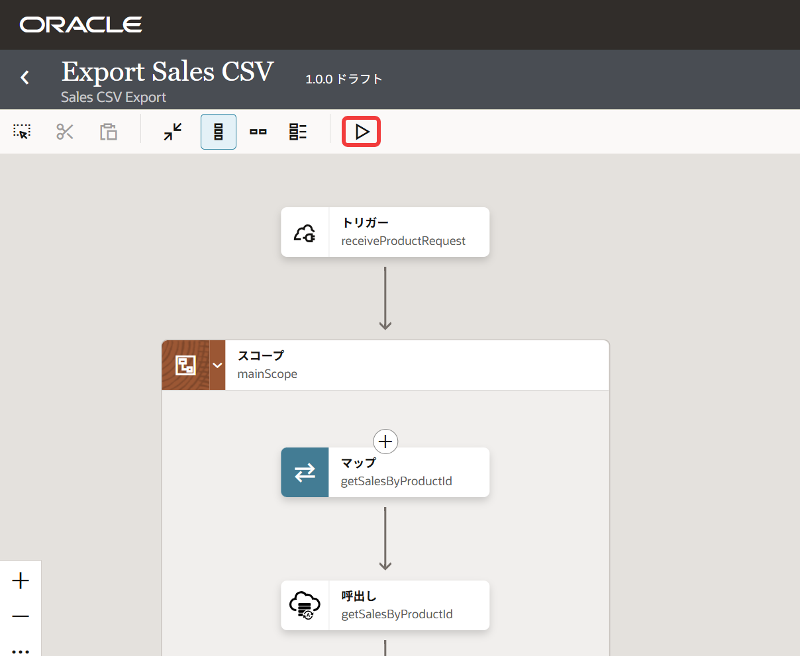
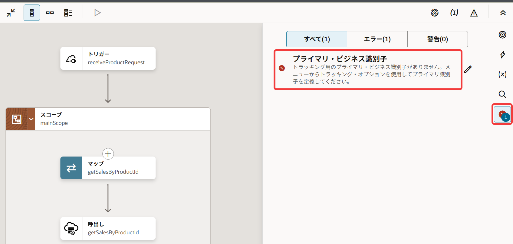
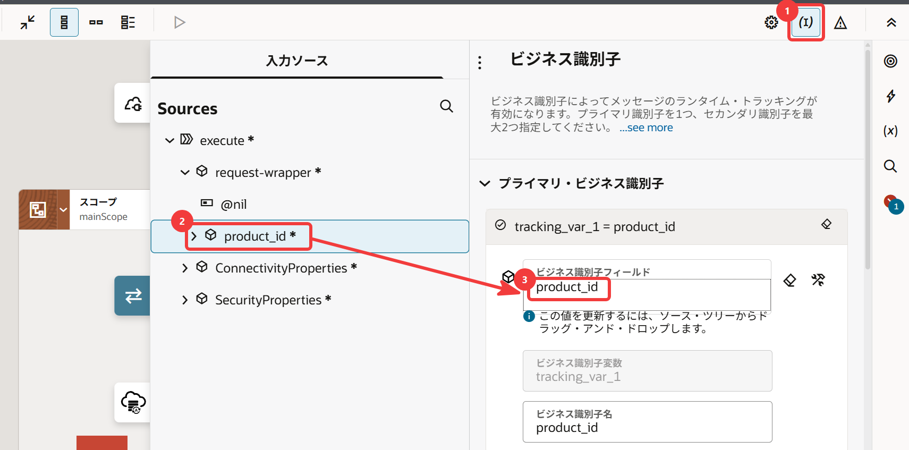
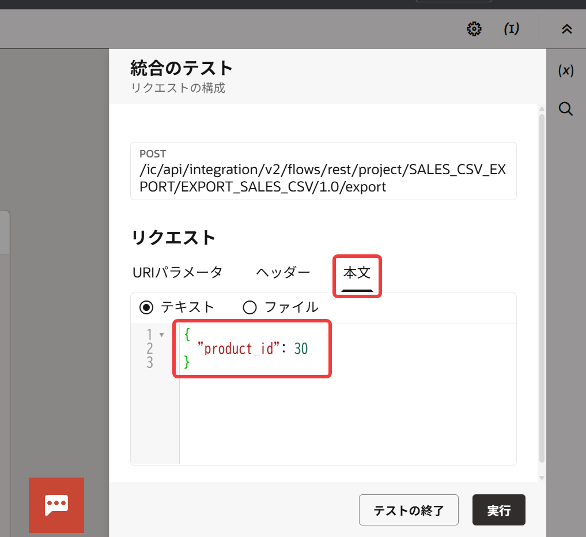
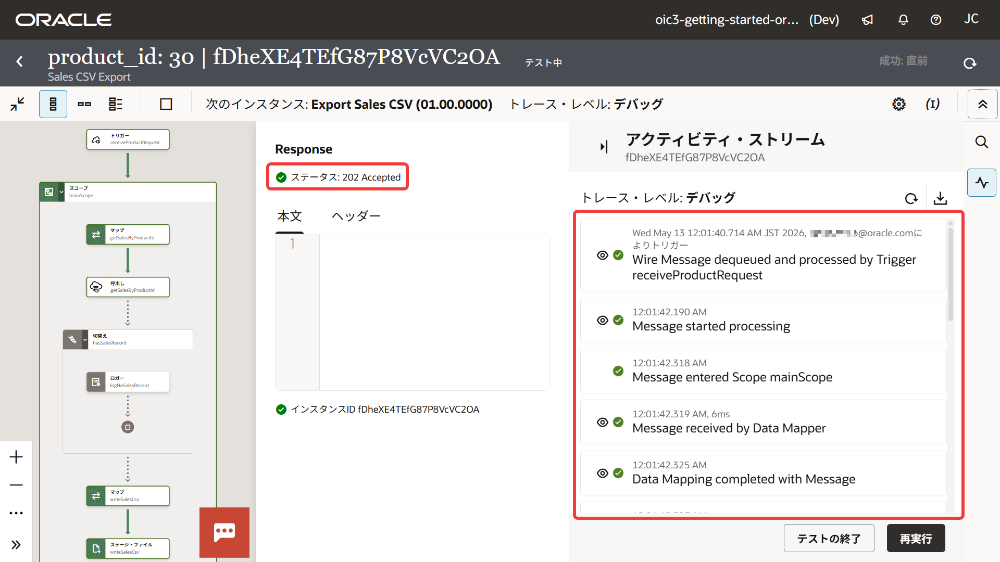

# 7. 統合のテスト

この章では、Oracle Integration の統合キャンバス上から統合をテスト実行し、動作確認を行います。

統合を実行するには通常、事前に ***アクティブ化*** という操作が必要ですが、REST アダプタ・トリガーを使用している統合は、 シームレスに動作確認が可能です。
統合キャンバスからのテスト実行は、設計と検証を素早く繰り返すための重要な機能です。

## 7.1 テストの実行

統合をテストするには、必ず統合を保存する必要があります。
統合が保存されていない場合は、**「保存」** をクリックして統合を保存します。

統合キャンバスのツール・バーにある **「テスト」** をクリックします。



画面右側に **「統合のテスト」** パネルが表示されますが、 **「統合をアクティブ化できませんでした」** というエラー・メッセージが表示されます。

エラーを解消するために **「テストの終了」** をクリックし、キャンバス上のエラーを確認します。

## 7.2 エラーの確認とビジネス識別子の設定

統合キャンバスの右側に **「エラー」** アイコンが表示されています。
**「エラー」** アイコンをクリックすると、現在の統合にあるエラーがリストされます。



エラー・メッセージは次のように表示されているはずです。

```txt
プライマリ・ビジネス識別子
トラッキング用のプライマリ・ビジネス識別子がありません。メニューからトラッキング・オプションを使用してプライマリ識別子を定義してください。
```

このエラーは、統合にビジネス識別子が設定されていないことが原因です。
ビジネス識別子は、統合の実行を識別・追跡するための項目で、この設定がないと、統合はアクティブ化できません。

統合のビジネス識別子は、次の手順で設定します。

1.  統合キャンバスの右上部にある **「ビジネス識別子」** をクリックします。

2.  **「入力ソース」** の **「Sources」** ツリーの要素をドラッグ & ドロップします。

    - ドラッグする要素: **「execute」** → **「request-wrapper」** → **「product_id」**
    - ドロップするターゲット: **「ビジネス識別子フィールド」**

    

3.  統合を保存します。
    エラー・アイコンの表示が消え、統合のステータスが **「ドラフト」** から **「構成済」** に変更されていることを確認します。

## 7.3 テストの再実行

エラーが解消されたら、変更を保存して再び **「テスト」** をクリックし、テストを実行します。

エラーが解消されていれば、 **「統合のテスト」** パネルで、リクエスト・パラメータの入力が可能になります。
「本文」タブをクリックし、次の入力例のように Oracle Integration に送信される JSON ペイロードを指定します。

```json
{
  "product_id": 30
}
```



入力後、 **「実行」** をクリックします。

## 7.4 実行結果の確認

統合が実行されると、HTTP ステータスとして `202 Accepted` が返されます。

`202 Accepted` は、REST API がリクエストを正常に受け付けたことを表すステータスです。
この時点では、統合処理自体が完了したことを意味するわけではありません。

画面の右側にはアクティビティ・ストリームが表示されます。



すべてのステップが正常に実行されると、統合キャンバスのアクションが緑色の枠線で表示されます。

アクティビティ・ストリームが表示された時点では、統合処理がまだ実行中の場合があります。

必要に応じて画面右上の 「リフレッシュ」 をクリックし、アクティビティ・ストリームに `Processing completed successfully` が表示されることを確認してください。

アクティビティ・ストリームは統合の実行状況やエラー確認に使用する重要な機能です。
また、各ステップをクリックすることで、処理の詳細やメッセージ内容を確認できます。

アクティビティ・ストリームを確認したら、 **「テストの終了」** をクリックします。

## 7.5 CSV ファイルの確認

このチュートリアルで作成した統合は、実行が成功すると、問合せ結果が CSV ファイルに書き込まれ Oracle Integration のファイル・サーバーにアップロードされます。
このセクションでは、チュートリアルでは、OCI Cloud Shell から SFTP コマンドを使用してファイルがアップロードされたことを確認します。

### 7.5.1 Cloud Shell からファイル・サーバーへの接続

OCI Cloud Shellは、ブラウザ上で利用できる管理用のコマンドライン環境です。
ローカルにツールをインストールすることなく、OCIリソースの操作やスクリプト実行を手軽に行えます。

本チュートリアルでは、Cloud Shell から、Oracle Integration のファイル・サーバーに接続する方法について説明します。

なお、SFTP クライアントをインストールされている方はそちらをお使いいただいて構いません。

1.  Cloud Shell を起動するため、Oracle Cloud コンソールの画面右上にある **「開発者ツール」** メニューをクリックし、 **「Cloud Shell」** を選択します。

2.  OCI Cloud Shell で次のコマンドを実行します。

    ```sh
    sftp -p <ポート番号> <ユーザー名>@<ホスト名>
    ```

    > **Note:**
    >
    > - <ポート番号> と <ホスト名> は、
    >   [6. ファイル連携](chapter6.md)
    >   の『6.4.2 ファイル・サーバーへの接続情報の取得』で確認したファイル・サーバーのポート番号とホスト名にそれぞれ置き換えてください。
    > - <ユーザー名> はOracle Integration のログイン時に使用したユーザー名と置き換えてください。

3.  Cloud Shell から SFTP ファイル・サーバーへの初回接続時には、以下のようなメッセージが表示されます。

    ```sh
    Are you sure you want to continue connecting (yes/no)?
    ```

    `yes` を入力して Enter キーを押します。

4.  続いて、パスワードの入力を求められます。
    Oracle Integration のログイン時に使用したパスワードを入力します。

### 7.5.2 ファイル一覧の確認

SFTP ファイル・サーバーに接続されたら、次の手順でファイル一覧を表示し、CSV ファイルがアップロードされたことを確認します。

1.  次のコマンドを実行します。

    ```sh
    ls
    ```

2.  次のように、CSVファイルが表示されていれば統合の実行は成功です。

    ```sh
    sales-1.csv
    ```

### 7.5.3 ファイルのダウンロード（任意）

ファイルの内容を確認する場合は、次のようにコマンドを実行してファイルをダウンロードします。

```sh
get sales-1.csv
```

ダウンロード後、次のコマンドで内容を確認できます。

```sh
cat sales-1.csv
```

### 7.5.4 接続の終了

SFTP 接続を終了するには、次のコマンドを実行します。

```sh
exit
```

## 7.6 トラブル・シューティング

統合の実行がエラーになった場合は、以下を参考にして統合を修正してください。

### ケース1：SQLエラー

- 原因: SQLの記述ミス
- 対処方法: ATP アダプタの設定を確認

### ケース2：FTP送信エラー

- 原因: 接続情報の誤り
- 対処方法: FTP アダプタの接続設定を確認

### ケース3：パラメータ未設定

- 原因: 必須パラメータ未入力
- 対処方法: 入力値を確認

## 7.7 この章のまとめ

この章では、統合キャンバス上のテスト機能を使用して統合の動作確認を行いました。

- 統合キャンバスからワン・クリックで統合を起動
- アクティビティ・ストリームで処理の流れを確認
- SFTP サーバーにCSVファイルが出力されたことを確認

次の章では、明示的に統合をアクティブ化し、Oracle Integration の外部から実行してみます。
