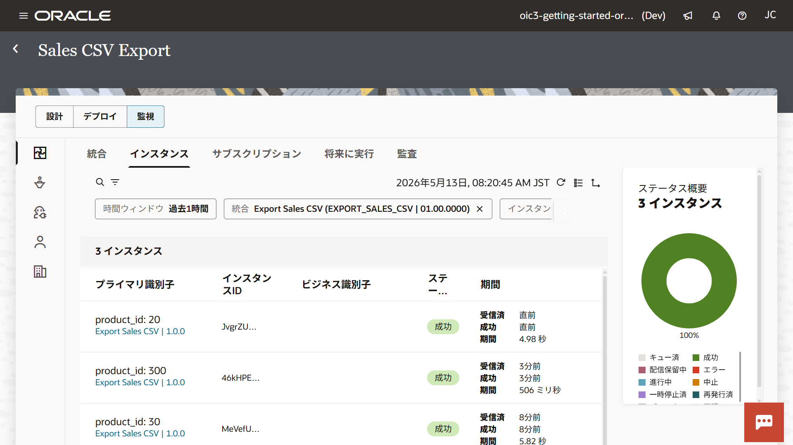
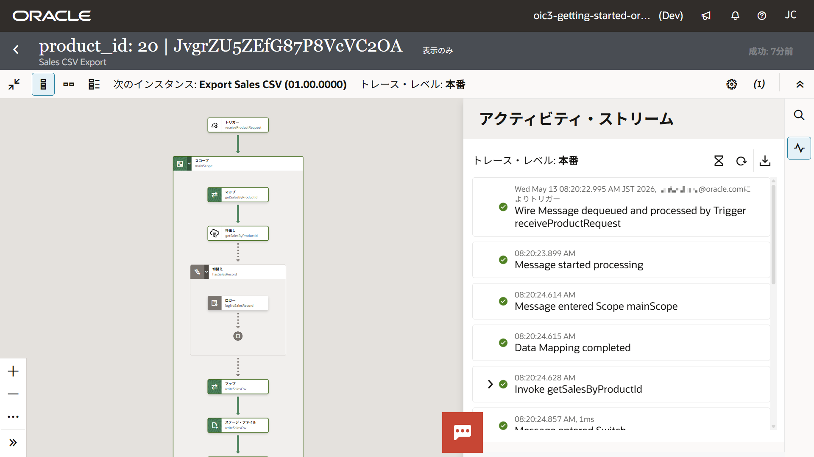

# 9. モニタリング

この章では、Oracle Integration のモニタリング機能を使用して、統合の実行状況や結果を確認する方法を学びます。

統合は「実行する」だけでなく、「結果を確認する」ことが重要です。
モニタリング機能を利用することで、処理の流れやエラーの原因を把握できます。

## 9.1 モニタリングとは

モニタリングとは、統合の実行状況や結果を確認するための機能です。

Oracle Integration では、モニタリングによって次のような情報を確認できます。

- 統合の実行履歴
- 実行結果（成功／失敗）
- 各処理ステップの詳細
- 入出力データ（ペイロード）

モニタリングによって得た情報を活用することで、動作確認や問題発生時の原因の特定が可能です。

## 9.2 実行履歴の確認

統合が実行されると、その実行ごとに *インスタンス* (実行履歴) が作成されます。
例えば、同じ統合を3回実行すると、3つのインスタンスが作成されます。

インスタンスは、プロジェクトの **「監視」** タブ・ページで確認できます。

1.  本チュートリアルで作成したプロジェクトのページを開きます。

2.  **「監視」** タブをクリックします。

3.  **「インスタンス」** を選択します。

    

    > **Note:**
    >
    > 初期状態では、直近1時間に実行されたインスタンスのみ表示されます。
    > 実行履歴が表示されない場合は、「時間ウィンドウ」の設定を変更してください。

4.  インスタンスのプライマリ識別子をクリックすると、詳細情報にドリルダウンできます。

    

> **Note:**
>
> Oracle Integration には、サービス全体の実行履歴を確認できる **「可観測性」** 画面（ナビゲーション・メニューから **「可観測性」** を選択）もあります。
> 複数のプロジェクトで運用する場合は、こちらの画面を使用すると便利です。

## 9.3 アクティビティ・ストリームによる実行の詳細

統合の詳細画面では、アクティビティ・ストリームを確認できます。
アクティビティ・ストリームは、統合の処理フローを可視化する機能です。

アクティビティ・ストリームでは次の内容を確認できます:

- 各ステップの実行順序
- 成功/失敗の状態
- 入出力データ (ペイロード)
- エラー・メッセージ（エラー発生時）

各ステップをクリックすることで、詳細な情報を確認できます。

## 9.4 トレース・レベルについて

Oracle Integration では、統合の実行時に記録されるログの詳細度を「トレースレベル」で制御します。

トレース・レベルには、次の3種類があります:

- デバッグ
- 監査
- 本番

### デバッグ

本チュートリアルの『[7. 統合のテスト](chapter7.md)』で紹介した、統合キャンバスからのテスト実行時は、このデバッグ・レベルが使用されます。

- 最も詳細なログが出力される
- ペイロード (リクエスト/レスポンス) を含む
- 各ステップの詳細な処理内容を確認可能

### 監査

監査レベルは、主に本番環境でトラブル調査を行う際に使用されます。

- 中程度のログが出力される
- ペイロード (リクエスト/レスポンス) を含む
- 実行の流れを確認可能

### 本番

統合をアクティブ化した場合、初期状態でトレース・レベルは本番レベルに設定されます。

- 最小限のログのみ出力される
- ペイロードは記録されない
- ステータスや基本情報のみ確認可能

### 各トレース・レベルの違い

| レベル | ペイロード | 詳細度 | 主な用途 |
| --- | --- | --- | --- |
| デバッグ | 含む | 高い | 開発・テスト |
| 監査 | 含む | 中程度 | 調査 |
| 本番 | 含まない | 低い | 通常運用 |

### トレース・レベルの選択のポイント

トレース・レベルが高いほど詳細な情報を取得できますが、その分ログの量が増加します。
この違いは、設計時の確認と本番運用のパフォーマンスを両立するためです。

通常運用時は本番レベルを使用し、必要に応じて監査レベルやデバッグ・レベルに変更するとよいでしょう。

## 9.5 ビジネス識別子による追跡

本チュートリアルの『[7. 統合のテスト](chapter7.md)』では、ビジネス識別子を設定しました。
ビジネス識別子は、統合インスタンスを識別・追跡するために使用されます。

プロジェクトの **「監視」** ページの **「インスタンス」** 一覧の **「プライマリ識別子」** には、プライマリのビジネス識別子とその値が表示されます。

例えば、本チュートリアルでは `product_id` をプライマリのビジネス識別子として設定しました。
これにより、特定の商品 ID の処理結果を検索することが可能です。

## 9.6 エラー発生時の確認ポイント

統合の実行でエラーが発生した場合は、次の手順で確認します。

1. プロジェクトの **「監視」** ページの **「インスタンス」** 一覧を開き、各インスタンスのステータスを確認
2. エラーが発生したインスタンスのプライマリ識別子または **「詳細の表示」** をクリック
3. アクティビティ・ストリームでエラーが発生した処理を確認

エラー・メッセージを確認し、原因に応じて設定を修正します。

## 9.7 この章のまとめ

この章では、Oracle Integration のモニタリング機能を使用して、統合の実行結果を確認する方法を学びました。

- 統合インスタンスの確認方法
- アクティビティ・ストリームの確認方法
- トレース・レベルによるログの違い
- ビジネス・識別子を使ったインスタンスの追跡

統合は「作成して終わり」ではなく、「実行結果を確認し、問題が発生した時には素早く原因を特定する」ことが重要です。

<!-- Appendix では、より実践的なエラー処理やスケジュール実行について学びます。 -->
